# 🥗 Recepti & Plan Ishrane

Web aplikacija koja korisnicima omogućava pregled i pretragu recepata te kreiranje personalizovanog tjednog plana ishrane. Registrovani korisnici mogu pregledavati recepte i planove ishrane, dok admin ima potpunu kontrolu nad sadržajem putem admin panela.

---

## 👥 Članovi tima

### Edvin Bešlić
**DWS:** Inicijalna struktura projekta, React routing i Auth Context, Navbar, Footer, Prijava, Registracija, useFetch hook, Recepti stranica sa pretragom i filterima, ReceptDetalji stranica, Kontakt stranica sa Google Maps, Admin panel sa CRUD operacijama, Skeleton loading, Breadcrumbs, Fade-in animacije, Admin kreiranje personalnog plana za korisnika

**OSiRuO:** docker-compose.yml, environment varijable, GitHub Actions deploy.yml, Vercel deployment (frontend), Render deployment (backend)

### Ammar Puščul
**DWS:** Landing stranica, ONama stranica, NotFound stranica, PlanIshrane stranica, Spinner komponent, Fontovi Playfair Display i Inter, Toast notifikacije, Named volume i environment varijable, Pokušaj GCP Deploymenta koji nije uspio

**OSiRuO:** Dockerfile backend (node:18-alpine), health-check.sh skripta, nginx konfiguracija

### Hena Neslanović
**DWS:** CSS varijable za boje, RecipeCard komponent, 150+ recepata u bazu, Toast na Prijavi i Registraciji, Unaprijeđen Admin panel sa statistikama, Zahtjevi za personalizirani plan, Favicon, Hero slika na Landing stranici, Paginacija na Recepti stranici, Sakrivena tipka za registraciju prijavljenim korisnicima

**OSiRuO:** Dockerfile frontend (multi-stage nginx), README dokumentacija

---

## 🛠️ Tech Stack

| Tehnologija | Verzija |
|-------------|---------|
| React | 18.x |
| Vite | 8.x |
| React Router | 6.x |
| Tailwind CSS | 4.x |
| Node.js | 24.x |
| json-server | latest |
| Docker | 24.x |
| nginx | alpine |

---

## 🏗️ Arhitekturni dijagram

```
┌─────────────────────────────────────────┐
│              BROWSER                     │
│         http://localhost:5173            │
└──────────────────┬──────────────────────┘
                   │
┌──────────────────▼──────────────────────┐
│           FRONTEND (React)               │
│         nginx:alpine – port 80           │
│                                          │
│  Pages: Landing, Recepti, Admin,         │
│  PlanIshrane, Kontakt, ONama, 404        │
│                                          │
│  Components: Navbar, Footer,             │
│  RecipeCard, Spinner, Toast              │
│                                          │
│  Context: AuthContext                    │
│  Hooks: useAuth, useFetch                │
└──────────────────┬──────────────────────┘
                   │ HTTP requests
┌──────────────────▼──────────────────────┐
│           BACKEND (json-server)          │
│         node:18-alpine – port 3001       │
│                                          │
│  Endpoints:                              │
│  /users, /recepti, /planIshrane,         │
│  /kontaktPoruke, /zahtjeviZaPlan         │
└──────────────────┬──────────────────────┘
                   │
┌──────────────────▼──────────────────────┐
│              db.json                     │
│         (persistentni podaci)            │
└─────────────────────────────────────────┘
```

---

## 🎨 Paleta boja i fontovi

| Boja | Hex | Upotreba |
|------|-----|----------|
| Tamno zelena | `#166534` | Navbar, headingi |
| Srednje zelena | `#15803d` | Dugmad, akcenti |
| Narandžasta | `#f97316` | CTA dugmad |
| Svijetlo siva | `#f9fafb` | Pozadina |
| Bijela | `#ffffff` | Kartice |

**Fontovi:**
- Heading: `Playfair Display`
- Body: `Inter`

---

## 👤 Korisničke uloge i prava pristupa

| Funkcija | Guest | Admin |
|----------|-------|-------|
| Pregled recepata | ✅ | ✅ |
| Pretraga recepata | ✅ | ✅ |
| Plan ishrane | ✅ | ✅ |
| Zahtjev za plan | ✅ | ❌ |
| Dodavanje recepta | ❌ | ✅ |
| Uređivanje recepta | ❌ | ✅ |
| Brisanje recepta | ❌ | ✅ |
| Admin panel | ❌ | ✅ |
| Pregled korisnika | ❌ | ✅ |
| Pregled poruka | ❌ | ✅ |
| Kreiranje plana za korisnika | ❌ | ✅ |

---

## 🚀 Lokalno pokretanje

### Prerequisites
- Node.js 18+
- npm
- Git
- Docker (opcionalno)

### Koraci

**1. Kloniraj repozitorij:**
```bash
git clone https://github.com/edvinbeslic/recepti-i-plan-ishrane.git
cd recepti-i-plan-ishrane
```

**2. Instaliraj dependencies:**
```bash
cd frontend
npm install
cd ..
```

**3. Pokreni backend:**
```bash
cd backend
npx json-server --watch db.json --port 3001
```

**4. Pokreni frontend (novi terminal):**
```bash
cd frontend
npm run dev
```

**5. Otvori browser:**
```
http://localhost:5173
```

### Docker pokretanje
```bash
docker compose up --build
```

### Test kredencijali
| Uloga | Email | Lozinka |
|-------|-------|---------|
| Admin | admin@recepti.ba | admin123 |
| Guest | gost@recepti.ba | gost123 |

---

## 🐳 OSiRuO – Tehnička dokumentacija

### Dockerfile – Frontend (Multi-stage build)

```dockerfile
# Stage 1: Build React aplikacije
FROM node:20-alpine AS build
WORKDIR /app
COPY package*.json ./
RUN npm install
COPY . .
RUN npm run build

# Stage 2: Serviranje sa nginx
FROM nginx:alpine
COPY --from=build /app/dist /usr/share/nginx/html
COPY nginx.conf /etc/nginx/conf.d/default.conf
EXPOSE 80
CMD ["nginx", "-g", "daemon off;"]
```

**Objašnjenje:**
- Stage 1 koristi Node.js za instalaciju dependencies i production build
- Stage 2 koristi nginx za serviranje statičkih fajlova
- nginx.conf sadrži `try_files` za podršku React Router-a
- Finalni image je manji od 150MB zahvaljujući alpine varijantama

### Dockerfile – Backend

```dockerfile
FROM node:18-alpine
WORKDIR /app
RUN npm install -g json-server
COPY db.json .
EXPOSE 3001
CMD ["json-server", "--watch", "db.json", "--host", "0.0.0.0", "--port", "3001"]
```

**Objašnjenje:**
- Koristi node:18-alpine kao base image
- Instalira json-server globalno
- Kopira db.json u image
- Pokreće json-server na svim interfejsima

### docker-compose.yml

```yaml
services:
  backend:
    build: ./backend
    ports:
      - "${BACKEND_PORT:-3001}:3001"
    volumes:
      - ./backend/db.json:/app/db.json
    environment:
      - PORT=3001
    healthcheck:
      test: ["CMD", "wget", "--spider", "http://localhost:3001/recepti"]
      interval: 30s
      timeout: 10s
      retries: 3

  frontend:
    build: ./frontend
    ports:
      - "${FRONTEND_PORT:-80}:80"
    environment:
      - VITE_API_URL=http://backend:3001
    depends_on:
      - backend
```

### Lokalno pokretanje sa Dockerom

```bash
# Pokretanje svih servisa
docker compose up --build

# Zaustavljanje
docker compose down

# Provjera logova
docker compose logs -f
```

Frontend dostupan na: `http://localhost:80`
Backend dostupan na: `http://localhost:3001`

---

/backend ./backend
docker push europe-west1-docker.pkg.dev/PROJECT_ID/recepti-repo/backend

### ☁️ Deployment

#### Frontend – Vercel
- Platforma: [Vercel](https://vercel.com)
- URL: https://recepti-frontend.vercel.app
- Auto-deploy na svaki push na `main` branch
- Environment variable: `VITE_API_URL=https://recepti-backend.onrender.com`

#### Backend – Render
- Platforma: [Render](https://render.com)
- URL: https://recepti-backend.onrender.com
- Build Command: `npm install json-server`
- Start Command: `./node_modules/.bin/json-server --watch db.json --host 0.0.0.0 --port 3001`
- Napomena: Free tier – server se gasi nakon neaktivnosti, prvi request može trajati 50+ sekundi

---

### 🔍 Health Check skripta

Skripta se nalazi u `scripts/health-check.sh` i provjerava dostupnost svih servisa.

```bash
# Pokretanje
./scripts/health-check.sh
```

Primjer izlaza:
Provjera backend servisa...
✅ Backend radi na http://localhost:3001/recepti
Provjera frontend servisa...
✅ Frontend radi na http://localhost:80
✅ Svi servisi rade ispravno!

---

### 💭 Refleksija tima

**Šta smo naučili:**
- React Context API i custom hooks su moćan alat za upravljanje globalnim stanjem bez potrebe za Redux-om
- Multi-stage Docker build značajno smanjuje veličinu finalnog imagea
- Nginx konfiguracija je ključna za React Router – bez `try_files` direktive refresh stranice vraća 404
- Vercel i Render su odlične besplatne alternative za deployment bez potrebe za karticom
- Git branching strategija i redovni commitovi olakšavaju timski rad i praćenje napretka

**Izazovi:**
- Billing setup nije bio moguć pa smo koristili Vercel i Render
- Konfiguracija nginx `try_files` za React Router je bila neočekivano složena
- Sinhronizacija rada između članova tima i izbjegavanje merge conflicta
- Backtick karakteri u JSX template literals su se gubili pri copy-paste iz dokumentacije

**Šta bismo uradili drugačije:**
- Koristili bismo pravu bazu podataka (PostgreSQL) umjesto json-server za produkcijsko okruženje
- Implementirali bismo JWT autentifikaciju umjesto localStorage
- Dodali bismo jedinične i integracijske testove
- Koristili bi GCP Billing da nismo imali problema sa njim

---

## 📸 Snimci ekrana

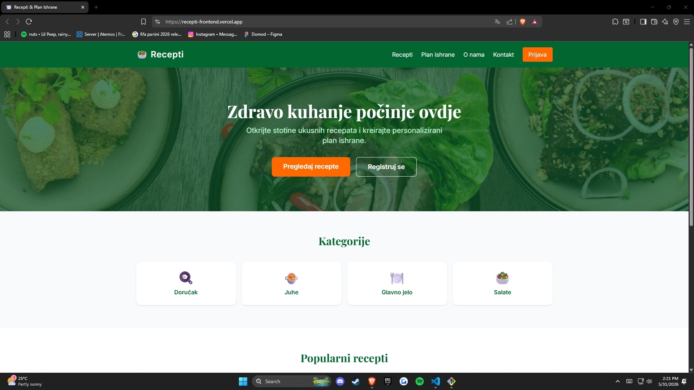
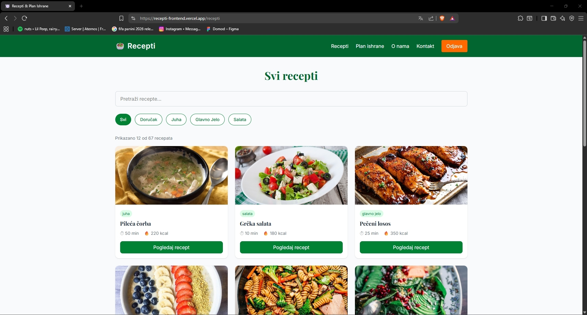
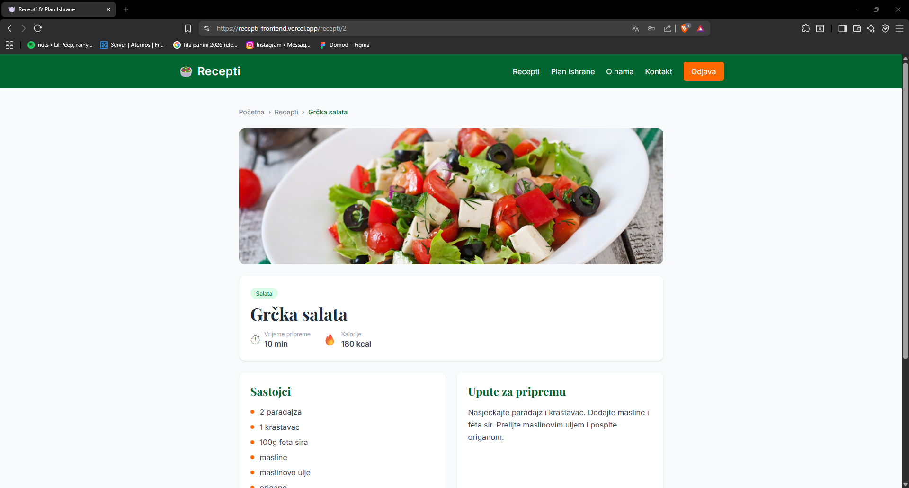
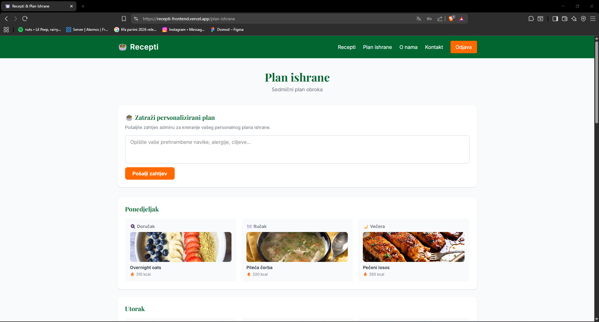
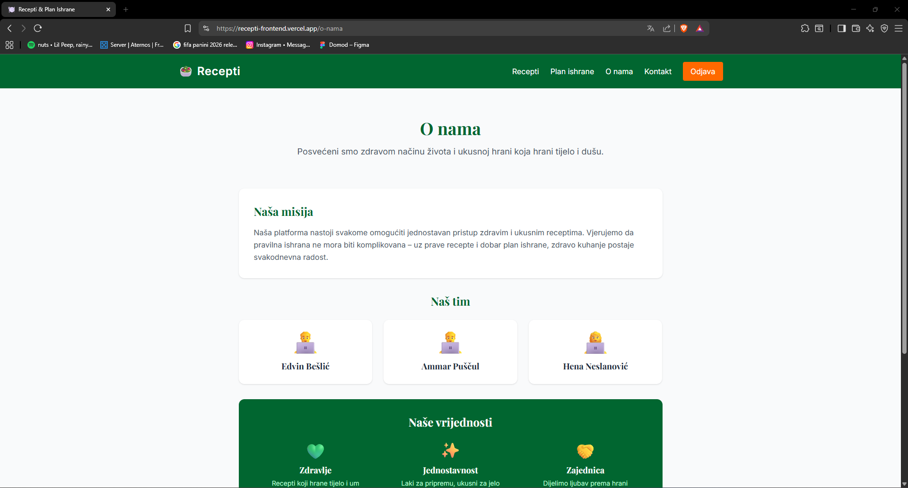
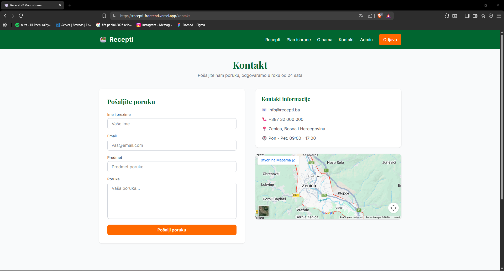
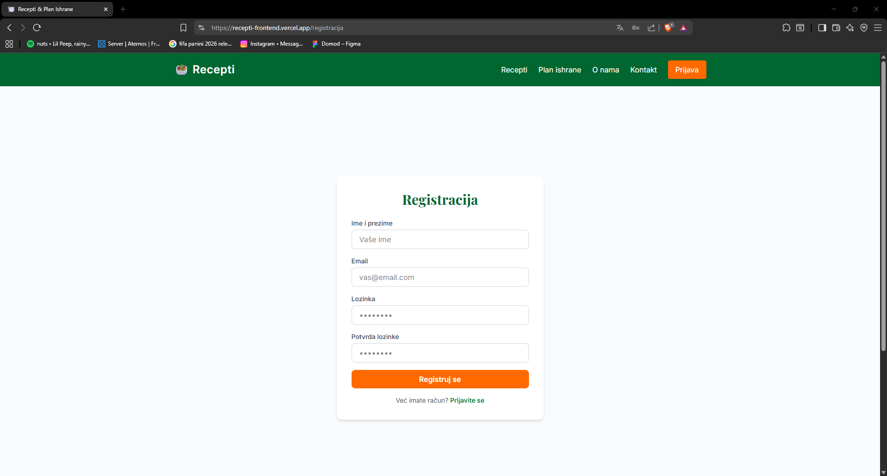
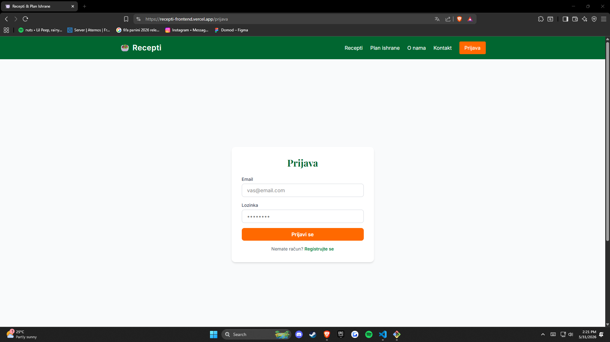
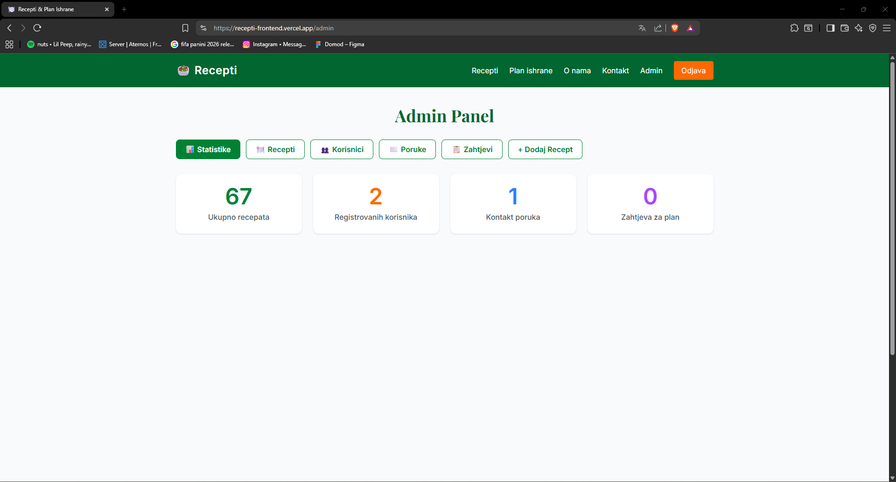
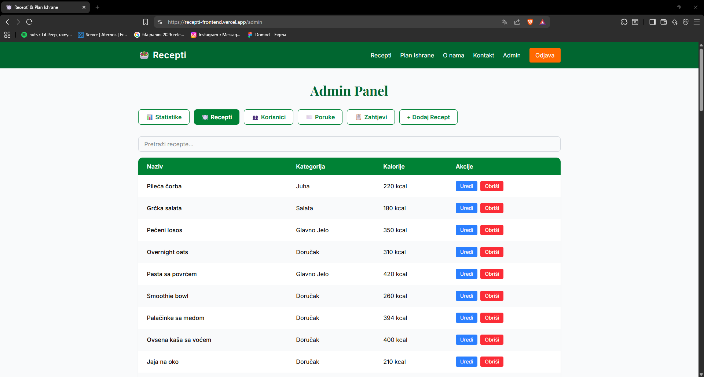
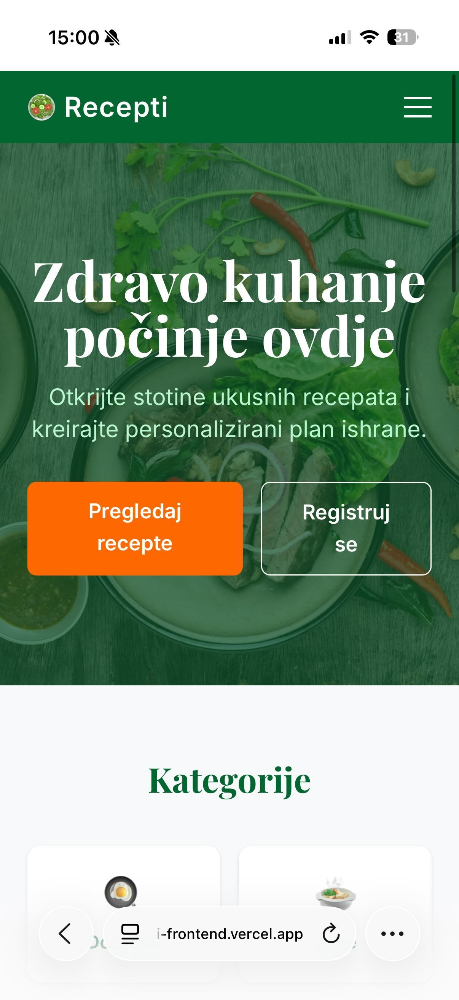